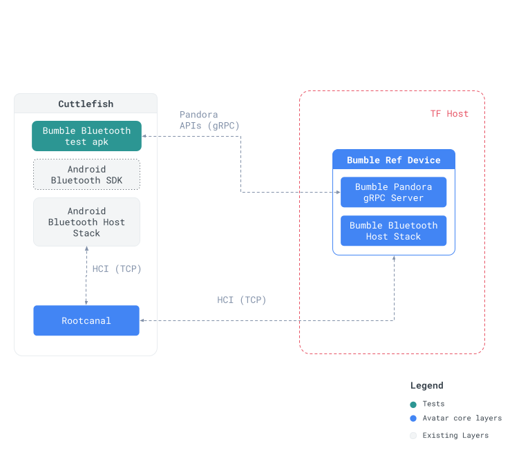

# BumbleBluetoothTests

Bumble Bluetooth tests are instrumented Android-specific multi-device tests using a reference
peer device implementing the Pandora APIs.

## Architecture

BumbleBluetoothTests is an Android APK that offers enhanced control over Android compared to Avatar
by interacting directly with the Device Under Test (DUT) via Android APIs. Instead of mocking every
API call, it communicates with actual reference devices using gRPC and limits peer device interactions
to the Pandora APIs.

Here is an overview of the BumbleBluetoothTests architecture:


A simple LE connection test looks like this:

```kotlin
@Rule @JvmField val mBumble = PandoraDevice()

@Test
fun testGattConnect() {
    // 1. Begin the test by advertising the host's Bluetooth capabilities using a gRPC call.
    // `hostBlocking()` accesses the host gRPC service.
    // `advertise(...)` sends an advertise request to the server, setting specific attributes.
    mBumble
        .hostBlocking()
        .advertise(
            AdvertiseRequest.newBuilder()
                .setLegacy(true)
                .setConnectable(true)
                .setOwnAddressType(OwnAddressType.RANDOM)
                .build()
        )

    // 2. Create a mock callback to handle Bluetooth GATT (Generic Attribute Profile) related events.
    val gattCallback = mock(BluetoothGattCallback::class.java)

    // 3. Connect to the Bumble device using the `connectGatt` method.
    // The method is called with `false` indicating that it should not automatically reconnect
    // to the GATT server when the connection is lost.
    var bumbleGatt = bumbleDevice.connectGatt(context, false, gattCallback)

    // 4. Verify that the connection was successful by checking the callback for a connected state.
    verify(gattCallback, timeout(TIMEOUT))
        .onConnectionStateChange(
            any(),
            eq(BluetoothGatt.GATT_SUCCESS),
            eq(BluetoothProfile.STATE_CONNECTED)
        )

    // 5. Disconnect the GATT connection to the Bumble device.
    bumbleGatt.disconnect()

    // 6. Verify that the disconnection was successful by checking the callback for a disconnected state.
    verify(gattCallback, timeout(TIMEOUT))
        .onConnectionStateChange(
            any(),
            eq(BluetoothGatt.GATT_SUCCESS),
            eq(BluetoothProfile.STATE_DISCONNECTED)
        )
}
```
